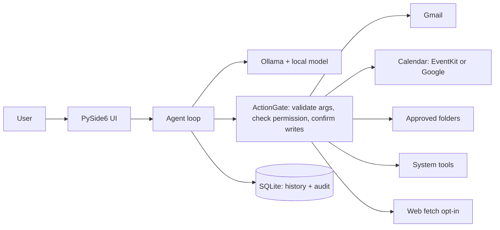

# Hearth

**A personal AI assistant that stays home.**

Hearth is a local-first desktop assistant for macOS, Windows, and Linux. It chats
with a language model running entirely on your machine (via [Ollama](https://ollama.com)),
and it can act for you — read and draft Gmail, manage your calendar, work with
files in folders you approve, and drive a small set of safe system actions.

Three rules define it:

1. **Local by default.** The model runs on your machine. Conversations, action
   history, and settings live in a local SQLite database. The only network
   traffic is to services you explicitly connect (Gmail/Google Calendar) or
   fetch (opt-in web access).
2. **Nothing changes without your OK.** Reads run automatically once you grant
   a permission. Every create, send, update, move, rename, or delete shows an
   exact preview card — Approve / Edit / Reject — before anything happens.
   Rejecting always leaves the world unchanged.
3. **Everything is auditable.** Every proposed action and its outcome is in the
   History tab. Deletes go to the Trash, not oblivion. OAuth tokens live in the
   OS credential store (Keychain / Credential Locker / Secret Service), never in
   files or the database.

---

## What Hearth can do

| Area | Automatic (after you grant it) | Only with confirmation |
|---|---|---|
| **Gmail** | Search mail, read messages, summarize threads | Create drafts, send email |
| **Calendar** | List calendars/events, find free slots | Create, update, delete events |
| **Files** | List, search, read text files in approved folders; **search file contents with line-level snippets** | Create, move/rename, delete (→ Trash) |
| **System** | Reveal files, notifications, read clipboard, open apps (macOS), **disk usage**, **top processes** | Open URLs, write clipboard, run approved macOS Shortcuts |
| **Reminders** | List open reminders (native EventKit on macOS, local on others) | Create, complete reminders |
| **Browser** | Read active Chrome tab title/URL (macOS, opt-in) | — |
| **Web** | Fetch a page as text (opt-in, off by default) | — |
| **Weather** | Current conditions + today's forecast for any city (opt-in, free Open-Meteo API — no key) | — |
| **Utilities** | Current date/time, exact arithmetic, **unit conversion (length/mass/temp/speed/area/volume/data/time)** | — |

Calendar uses native EventKit on macOS (Google calendars already synced to
Apple Calendar just work) and the Google Calendar API on Windows/Linux.

What Hearth deliberately does **not** have: arbitrary shell or AppleScript
execution, unrestricted filesystem access, screen control, telemetry, cloud
model fallback, background monitoring, or autonomous scheduled actions.


## What you need to download

| What | Where | Needed for |
|---|---|---|
| **Python 3.11 or 3.12** | [python.org](https://www.python.org/downloads/) or `brew install python@3.11` | Running from source |
| **Ollama** | [ollama.com/download](https://ollama.com/download) (macOS/Windows/Linux) | The local model runtime |
| **A model** | `ollama pull gemma4:e2b` (≈7 GB, fits 8 GB RAM) | The brain. Use `gemma4:e4b` on 16 GB+ |
| **Google OAuth credentials JSON** *(optional)* | Google Cloud Console — see [docs/google-oauth.md](docs/google-oauth.md) | Only for Gmail (and Google Calendar on Windows/Linux) |

Everything else is installed by `pip` in the steps below.

## Setup

The easy way — one command on any OS:

```bash
cd hearth
python3 run.py                          # Windows: py run.py
```

`run.py` finds a compatible Python (3.11/3.12), creates `.venv/`, installs
dependencies on first run, and launches the app. Run it again anytime — it
skips straight to launching once set up.

<details>
<summary>Manual setup (contributors)</summary>

```bash
cd hearth
python3.11 -m venv .venv                # Windows: py -3.11 -m venv .venv
source .venv/bin/activate               # Windows: .venv\Scripts\activate
pip install -e ".[dev]"
python -m hearth                        # or ./scripts/dev.sh
```

</details>

You don't need to start Ollama yourself — if the daemon isn't running, Hearth
starts it, and stops it again on quit **only** if Hearth was the one that
started it. Hearth never downloads a model on its own; if the configured model
is missing it tells you the exact `ollama pull` command instead.

### First-run checklist

1. Open **Settings** → confirm the model name (`gemma4:e2b` by default).
2. Open **Permissions** → enable what you want Hearth to touch:
   - *Files*: add one or more approved folders.
   - *Calendar*: grant access (macOS shows the system Calendar prompt).
   - *Gmail*: set the credentials file in Settings first, then Connect.
   - *System / Web / Shortcuts / Browser*: enable per taste — all off by default.
3. Chat. Try the suggestion chips: "What's on my calendar tomorrow?",
   "Summarize my unread email", "Find a free 1-hour slot this week".

## Configuration

Settings live in a per-user `config.toml`
(macOS: `~/Library/Application Support/Hearth/`, Windows: `%LOCALAPPDATA%\Hearth\`,
Linux: `~/.local/share/Hearth/`). See [config.example.toml](config.example.toml)
for every option. The in-app Settings screen edits the important ones.

**Switching models:** pull any tool-capable Ollama model and set its name in
Settings. For models whose template lacks native tool support, Hearth
automatically falls back to a JSON tool-calling protocol.

**8 GB machines:** keep `context_length` at 4096, close memory-hungry apps
during long chats, and prefer `e2b`-class models. Hearth runs one generation at
a time and lets Ollama unload the model after `keep_alive` (default 5 minutes).

## Development

```bash
./scripts/test.sh          # pytest — 90 tests, no network, no real side effects
./scripts/format.sh        # ruff format + lint
./scripts/package.sh       # PyInstaller build for the current platform
```

Tests never send mail, modify calendars, or touch files outside pytest temp
directories. The manual pre-release checklist is in
[docs/smoke-tests.md](docs/smoke-tests.md).

Packaging produces `dist/Hearth.app` (macOS), `dist/Hearth/Hearth.exe`
(Windows), or `dist/Hearth/Hearth` (Linux). PyInstaller does not cross-compile —
build on the platform you're shipping for.

## Architecture



- The **model proposes; the gate disposes.** Only registered tools can run, only
  through the `ActionGate`, and only after Pydantic argument validation.
- **Tool output is data, not instructions.** Everything a tool returns is framed
  as quoted content before the model sees it, so an email that says "delete all
  files" is something to report, not obey.
- The agent is capped at 6 tool steps per request, stops early if the same call
  fails twice, and can be cancelled at any time with Stop.

Layout: `src/hearth/` — `runtime/` (Ollama lifecycle + provider), `agent/`
(registry, gate, loop), `connectors/` (gmail, calendar, files, system, utility),
`storage/` (SQLite, credential store), `ui/` (views), `permissions.py`,
`app.py` (composition root). Tests mirror this in `tests/`.

## Docs

- [docs/google-oauth.md](docs/google-oauth.md) — getting your Gmail credentials file
- [docs/permissions.md](docs/permissions.md) — what each permission unlocks, per platform
- [docs/smoke-tests.md](docs/smoke-tests.md) — manual verification checklist
- [docs/troubleshooting.md](docs/troubleshooting.md) — Ollama, memory, Keychain, OAuth issues
- [docs/extended-plan.md](docs/extended-plan.md) — capability roadmap and design decisions
